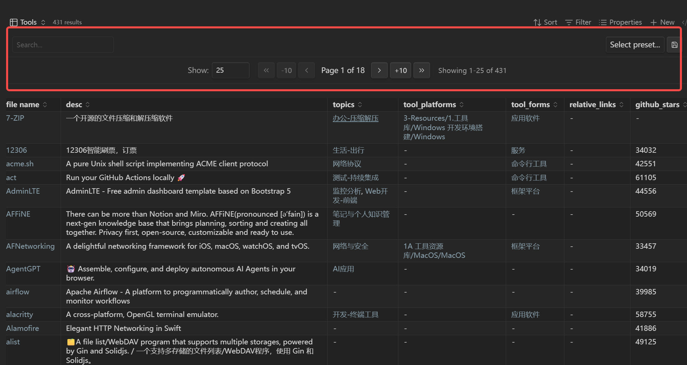

# Bases Paginator

A plugin for [Obsidian](https://obsidian.md) that adds a paginated table view with column filtering to Obsidian Bases.

> **Note:** Requires Obsidian v1.10.0+ with the Bases core plugin enabled.



## Features

- **Pagination**: Navigate large datasets with configurable page sizes (10/25/50/100)
- **Global Search**: Real-time search across all visible columns
- **Column Filters**: Multi-select dropdown filters on column headers (right-click to enable)
- **Sorting**: Click column headers to sort with natural ordering (e.g., "file2" before "file10")
- **Filter Presets**: Save and restore filter combinations
- **Sticky Header**: Keep table header visible when scrolling
- **Native Rendering**: Uses Bases' native rendering for links, tags, etc.

## Limitations

This is a **read-only** custom view. Due to Bases API limitations:

- Cannot edit cell values (use native Bases Table view or edit source files)
- Cannot add/delete rows or list items

## Usage

### In `.base` Files

1. Open any `.base` file in Obsidian
2. Click the view switcher in the toolbar
3. Select **"Paginated Table"** from the view options
4. Configure view options:
   - Items per page
   - Filterable columns (or right-click column headers to enable)
   - Toggle search box
   - Show/hide filter bar
   - Sticky header
   - Pagination position (top/bottom)

### In Markdown (Base Code Block)

You can embed a paginated table directly in any Markdown note using a base code block:

````markdown
```base
filters:
  and:
    - file.hasTag("task")
views:
  - type: paginated-table
    name: "My Tasks"
    pageSize: "25"
    showSearchBox: true
    showFilterBar: true
    stickyHeader: true
    paginationPosition: "top"
```
````

### View Options Reference

| Option               | Type     | Default    | Description                                      |
| -------------------- | -------- | ---------- | ------------------------------------------------ |
| `pageSize`           | string   | `"25"`     | Items per page (`"10"`, `"25"`, `"50"`, `"100"`) |
| `showSearchBox`      | boolean  | `true`     | Show global search input                         |
| `filterableColumns`  | string[] | `[]`       | Columns with filter dropdowns (property IDs)     |
| `showFilterBar`      | boolean  | `true`     | Show filter bar with search and presets          |
| `stickyHeader`       | boolean  | `true`     | Keep table header visible when scrolling         |
| `paginationPosition` | string   | `"top"`    | Position of pagination bar (`"top"` or `"bottom"`) |

### Embedding Base Views

You can also embed a specific view from a `.base` file into another note:

```markdown
![[MyDatabase.base#My Tasks]]
```

This will render the "My Tasks" view (if it's a paginated-table type) inline in your note

## Installation

### From Community Plugins (Coming Soon)
1. Open Obsidian Settings
2. Go to Community Plugins
3. Search for "Bases Paginator"
4. Click Install, then Enable

### Using BRAT
1. Install [BRAT](https://github.com/TfTHacker/obsidian42-brat) from Community Plugins
2. Open BRAT settings and click "Add Beta plugin"
3. Enter repository URL: `https://github.com/sean2077/obsidian-bases-paginator`
4. Click "Add Plugin" and enable it in Community Plugins

### Manual Installation
1. Download `main.js`, `styles.css`, and `manifest.json` from the latest release
2. Create folder: `VaultFolder/.obsidian/plugins/bases-paginator/`
3. Copy the downloaded files into the folder
4. Reload Obsidian
5. Enable the plugin in Settings > Community Plugins

## Development

```bash
# Install dependencies
npm install

# Development mode (watch)
npm run dev

# Production build
npm run build

# Lint code
npm run lint
```

## Requirements

- Obsidian v1.10.0 or higher
- Bases core plugin enabled

## License

See [LICENSE](./LICENSE).
